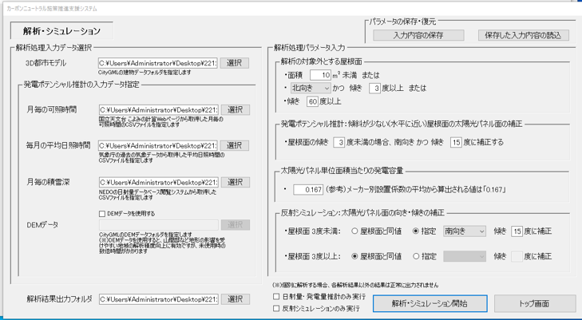

# カーボンニュートラル施策推進支援システム <!-- OSSの対象物の名称を記載ください。分かりやすさを重視し、できるだけ日本語で命名ください。英語名称の場合は日本語説明を（）書きで併記ください。 -->

 <!-- OSSの対象物のスクリーンショット（画面表示がない場合にはイメージ画像）を貼り付けください -->

## 1.概要 <!-- 本リポジトリでOSS化しているソフトウェア・ライブラリについて1文で説明を記載ください -->
本リポジトリでは、令和4年度Project PLATEAUのユースケース開発業務のUC22-013「カーボンニュートラル施策推進支援システムの開発」の成果物である「カーボンニュートラル施策推進支援システム」のソースコードを公開しています。

「カーボンニュートラル施策推進支援システム」は、PLATEAUの3D都市モデルを活用し太陽光発電ポテンシャル推計・反射シミュレーション及び対象施設・エリアの適地判定を行うためのシステムです。

## 2.「カーボンニュートラル施策推進支援システムの開発」について <!-- 「」内にユースケース名称を記載ください。本文は以下のサンプルを参考に記載ください。URLはアクセンチュアにて設定しますので、サンプルそのままでOKです。 -->
令和4年度の3D 都市モデルを活用した社会的課題解決型ユースケース開発業務「カーボンニュートラル施策推進支援システム」では、脱炭素施策推進のためのロードマップや計画策定、太陽光発電促進の重点エリア、将来の土地利用のあり方の検討などを支援し、地域の脱炭素政策の推進するため本システムを開発しました。  
本システムは、行政職員向けのGUIを備えたオープンソースソフトウェアとしてフルスクラッチで開発されています。  
太陽光発電ポテンシャルの推計及び推計結果の建物屋根面への重畳、反射シミュレーションと光害発生時間推計といった解析シミュレーション機能に加えて、発電ポテンシャルの集計機能、建物構造や災害リスク等の条件に応じた太陽光パネルの適地判定機能を実装しています。  
詳細は[技術検証レポート](https://www.mlit.go.jp/plateau/file/libraries/doc/plateau_tech_doc_0030_ver01.pdf)を参照してください。

## 3.利用手順 <!-- 下記の通り、GitHub Pagesへリンクを記載ください。URLはアクセンチュアにて設定しますので、サンプルそのままでOKです。 -->
本システムの構築手順及び利用手順は[利用チュートリアル](https://project-plateau.github.io/UC22-013-SolarPotential/index.html)を参照してください。

## 4.システム概要 <!-- OSS化対象のシステムが有する機能を記載ください。 -->
### 【解析・シミュレーション】
#### 日射量推計機能
建物ごとの月間・年間日射量を推計します。推計にあたり、日射量と3D都市モデルから算出した屋根の傾斜・方位角を利用し、日照率・傾斜・方位条件による補正を行います。
 

#### 発電ポテンシャル推計機能
建物ごとの年間発電量を推計します。JIS C 8907「太陽光発電システムの発電電力量推定方法」(2005年)を参照し、以下の式で算出します。
 
EPY=P∗HAY∗KPY∗1/GS
 
EPY：年間予測発電年量（kWh/年）、　P：設置可能システム容量（推定）(kW)、　HAY：年間予測日射量（kWh/m^2・年）、GS：標準試験条件による日射強度（kW・m^2）
 

#### 反射シミュレーション機能
建物単位（パネルごと）の反射シミュレーションを実施し、建物に当たる反射光（反射点・到達点）を抽出します。アルゴリズムは近畿地方整備局に掲載されたU2076A 「太陽光発電における光害検討の簡易化手法について」(2020年)を活用します。
 

#### 光害発生時間推計機能　
建物単位の光害発生時間を集計します。夏至、冬至、春分の各3日間について1時間ごとに太陽光発電パネルに太陽光が入射する場合の反射光を計算し、他の建物に当たるか判定し、反射光が他の建物に到達した時刻を抽出し、時刻数の総和を光害発生時間とします。

### 【適地判定・集計】
#### 集計機能
選択した範囲（エリア）内の建物を集計します。 
#### パネル設置適地判定機能
選択した範囲（エリア）において、重畳データ読み込み機能で読み込んだ各データ項目の値を集計し、予め設定した判断条件（災害リスク・パネル設置基準）と比較し、条件に該当する建物を抽出します。

## 使用技術

| 種別              | 名称   | バージョン | 内容 |
| ----------------- | --------|-------------|-----------------------------|
| ミドルウェア       | poetry | 1.3.2 | Pythonライブラリの管理 |
| ライブラリ      | GeoAlchemy2 | 0.10.2 | SQL データベースを Python で利用するためのライブラリ   SQLAlchemyの空間データベース機能拡張（PostGIS にアクセスするために使用） |
|^      | Jageocoder | 2.0.0 | 住所ジオコーダライブラリ（不動産登記情報の所在地を登記所備付地図と突合するために使用） |

## 5.システム動作環境 <!-- 動作環境についての仕様を記載ください。 -->
| 項目               | 最小動作環境                                                                                                                                                                                                                                                                                                                                    | 推奨動作環境                   | 
| ------------------ | ----------------------------------------------------------------------------------------------------------------------------------------------------------------------------------------------------------------------------------------------------------------------------------------------------------------------------------------------- | ------------------------------ | 
| OS                 | Microsoft Windows 10 または 11                                                                                                                                                                                                                                                                                                                  | Microsoft Windows 10 または 11 | 
| CPU                | Intel Core i3以上                                                                                                                                                                                                                                                                                                                               | Intel Core i5以上              | 
| メモリ             | 4GB以上                                                                                                                                                                                                                                                                                                                                         | 8GB以上                        | 
| ディスプレイ解像度 | 1024×768以上                                                                                                                                                                                                                                                                                                                                    | 1024×768以上                   | 
| ネットワーク       | 【解析・シミュレーション】 不要 【適地判定・集計】 範囲選択を使用しない場合はネットワーク環境不要。 範囲選択機能を使用する場合、以下のURLを閲覧可能な環境が必要。 国土地理院　地理院地図　 http://cyberjapandata.gsi.go.jp 地図表示のため標準地図を参照。 URL：https://cyberjapandata.gsi.go.jp/xyz/std/{z}/{x}/{y}.png |<                              | 

## 6.ソースファイルの構成 <!-- 本GitHub上のソースファイルの構成を記載ください。 -->
SolarPotential　　　　　　ソリューション 
　　　|--- AggregateData      【パネル設置適地判定のデータ管理】 
　　　|--- AnalyzeData        【解析・シミュレーションのデータ管理】 
　　　|--- Analyzer           【解析・シミュレーションの処理】 
　　　|--- CommonUtil         【SHPやGeoTIFFのデータ処理やファイル操作】 
　　　|--- JudgeSuitablePlace 【パネル設置適地判定の処理】 
　　　|--- SolarPotential     【GUI】 

## 7.ライセンス <!-- 変更せず、そのまま使うこと。 -->

- ソースコードおよび関連ドキュメントの著作権は国土交通省に帰属します。
- 本ドキュメントは[Project PLATEAUのサイトポリシー](https://www.mlit.go.jp/plateau/site-policy/)（CCBY4.0および政府標準利用規約2.0）に従い提供されています。

## 8.注意事項 <!-- 変更せず、そのまま使うこと。 -->

- 本リポジトリは参考資料として提供しているものです。動作保証は行っておりません。
- 予告なく変更・削除する可能性があります。
- 本リポジトリの利用により生じた損失及び損害等について、国土交通省はいかなる責任も負わないものとします。

## 9.参考資料 <!-- 技術検証レポートのURLはアクセンチュアにて記載します。 -->
- 技術検証レポート: https://www.mlit.go.jp/plateau/file/libraries/doc/plateau_tech_doc_0030_ver01.pdf
- PLATEAU Webサイト Use caseページ「カーボンニュートラル推進支援システム」: https://www.mlit.go.jp/plateau/use-case/uc22-013/
- 利用ライブラリ
  - shapelib：https://github.com/OSGeo/shapelib 
